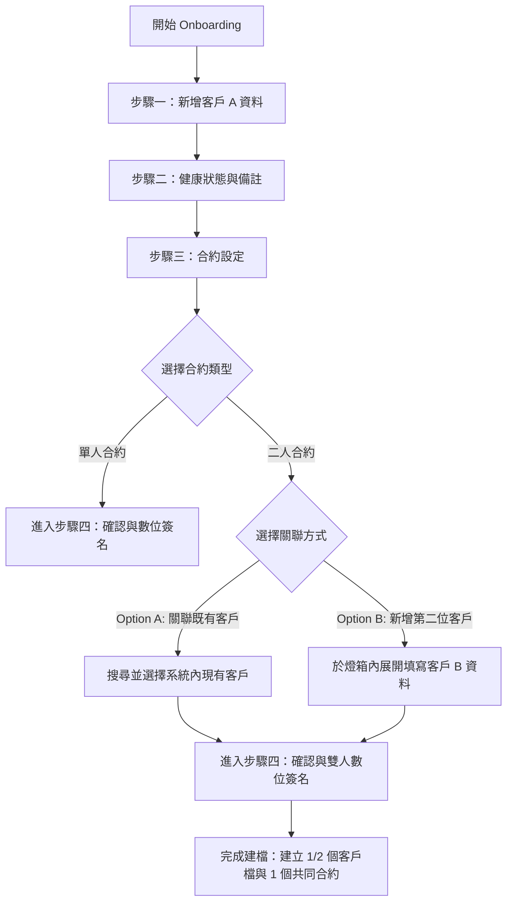

# R27+ Fitness 雙人合約功能開發規格與更新計劃
## R27+ Fitness Dual Contract Feature System Specification & Implementation Plan

---

## 1. 背景與功能目標 (Background & Objectives)

目前 R27+ 系統僅支援「單一合約對單一客戶」的架構。為了配合雙人同行、親子、伴侶等多人上課的商業模式，系統需要支援 **「雙人合約 (Dual Contract)」**。
本文件旨在規劃此功能的完整技術規格與實作計畫，確保新功能兼顧極致的 UI/UX 體驗，並與現有單人合約流程完全相容（Backward Compatible）。

### 核心目標
* **一對多關聯**：單一合約支援綁定 1 位（單人合約）或 2 位客戶（雙人合約）。
* **極致體驗**：在新增客戶與續約流程中，無縫整合雙人設定，支援關聯老客戶或現場直接新建第二位客戶。
* **授權扣課**：雙人合約可由兩位成員共同使用，上課扣數扣除同一合約額度。
* **向下相容**：現有單人合約資料與流程不受影響，舊資料平滑移轉。

---

## 2. 資料庫模型更新與相容方案 (Database Schema & Migration)

為了在 Firestore 中高效率查詢單人與雙人合約，我們將利用 Firestore 的 `array-contains` 索引查詢特性，對資料庫模型進行優化。

### 2.1 建議資料表（集合）結構

#### `customers` 集合（未改變，僅作關聯對照）
```typescript
interface Customer {
  id: string
  trainerId: string
  name: string
  phone: string
  email: string
  // ... 其他基本欄位
}
```

#### `contracts` 集合（合約資料表更新）
我們將棄用原有的單一 `customerId` 與 `sharedWithCustomerId` 欄位（保留作為相容），改用陣列結構並新增合約類型欄位：

```diff
interface Contract {
  id: string
  trainerId: string
- customerId: string                      // 舊相容欄位
- sharedWithCustomerId: string | null     // 舊相容欄位
+ customerIds: string[]                   // [必填] 儲存所有關聯客戶的 ID。單人合約長度為 1，雙人為 2
+ contractType: 'single' | 'dual'        // [必填] 合約類型
+ primaryCustomerId: string               // [必填] 合約主聯絡人（扣款/簽名主體）
  totalSessions: number
  remainingSessions: number
  pricePerSession: number
  totalAmount: number
  paidAmount: number
  // ... 其他合約欄位
}
```

#### 💡 Firestore 查詢優化
藉由引進 `customerIds: string[]`，我們在查詢某客戶的所有合約（包含他作為主簽署人或雙人合約副簽署人）時，只需要**單一查詢**，免去客戶端合併去重的效能損耗：
```typescript
const q = query(
  collection(db, 'contracts'),
  where('customerIds', 'array-contains', targetCustomerId)
);
```

### 2.2 舊資料相容與遷移方案 (Migration Plan)

為了保障舊系統資料不受損，我們必須在系統上線時執行一次性資料遷移（Migration Script）：

```typescript
// 遷移邏輯虛擬碼
async function migrateExistingContracts() {
  const contractsSnapshot = await getDocs(collection(db, 'contracts'));
  for (const docObj of contractsSnapshot.docs) {
    const data = docObj.data();
    if (!data.customerIds) {
      const customerIds = [data.customerId];
      if (data.sharedWithCustomerId) {
        customerIds.push(data.sharedWithCustomerId);
      }
      
      await updateDoc(doc(db, 'contracts', docObj.id), {
        customerIds: customerIds,
        contractType: data.sharedWithCustomerId ? 'dual' : 'single',
        primaryCustomerId: data.customerId
      });
    }
  }
}
```

---

## 3. Onboarding / 新增客戶流程更新 (UX & Workflow)

在新建學員檔案與初始合約時，需要將「雙人設定」整合至既有的步驟導覽精靈（Wizard）中。



### 3.1 UI/UX 詳細設計

1. **合約類型切換器 (Type Selector)**:
   * 在「合約設定」頁面中，以直覺的 Tab 或 Radio 按鈕呈現：
     * `[ 👤 單人合約 ]`
     * `[ 👥 雙人合約 ]`
   * 當點擊「雙人合約」時，下方滑出 **「第二位學員資訊」** 區域。

2. **Option A：關聯現有客戶 (Link Existing Customer)**:
   * 提供下拉式搜尋框（Auto-complete Search），支援輸入**姓名**、**電話**或**身分證後四碼**。
   * 搜尋結果限該教練名下的學員（管理員可搜尋全局學員）。
   * 選擇後，卡片展示該學員的姓名與電話，並提供 `[清除/重新選擇]` 按鈕。

3. **Option B：現場新增第二位客戶 (Create Inline Customer)**:
   * 點擊 `[新增全新客戶]` 後，於原對話框中以側邊抽屜（Drawer）或嵌合表單展開。
   * 填寫基本資料（姓名、電話、生日、緊急聯絡人、健康狀態）。
   * 送出後，此客戶資料暫存於表單狀態中，待最後確認時一次性與主客戶、合約寫入資料庫。

4. **確認與雙人簽署頁面**:
   * 提供兩格電子簽名板：`[ 主簽署人 (客戶 A) ]` 與 `[ 共同簽署人 (客戶 B) ]`。
   * 兩位皆完成簽名且勾選同意條款後，方可送出。

---

## 4. 老客戶續約流程更新 (Renewal Workflow)

為已存在的客戶進行續約（或是補簽新合約）時，同樣支援靈活的合約類型切換。

### 4.1 續約工作流設計

* **情境一：單人續約單人合約**：沿用現有邏輯，直接進入合約與簽名。
* **情境二：原雙人合約續約（沿用組合）**：
  * 當系統偵測到該客戶前一份合約為雙人合約時，預設自動帶入原來的第二位客戶資訊。
  * 提供 `[沿用此雙人組合]` 快速鍵。
* **情境三：變更第二位學員**：
  * 可點擊清除按鈕，將原先 the 第二位客戶移除。
  * 重新透過 **Option A（關聯現有客戶）** 或 **Option B（新增第二位客戶）** 綁定新的搭檔。

---

## 5. UI 可視化更新 (UI/UX Visualization)

雙人合約的狀態必須在管理介面中被清晰呈現，讓教練能一眼看出合約是誰與誰共享。

### 5.1 客戶名單 (Customer List)
* **狀態標籤**：若該客戶擁有有效的雙人合約，在其姓名旁或合約狀態欄位顯示 `[ 👥 雙人合約 ]` 徽章 (Badge)。
* **共享標記**：在「剩餘堂數」旁以細字顯示 `(與 [搭檔姓名] 共享)`。

### 5.2 合約列表 (Contract List)
* **聯絡人欄位**：將原本的「客戶姓名」欄位更新為展示兩位成員。
  * 例如：`林大明 ＆ 陳小美`。
* **類型徽章**：明確區分 `[ 單人 ]` (灰色/藍色) 與 `[ 雙人 ]` (綠色/紫色)。

### 5.3 客戶詳細資料彈窗 (Customer Details Modal)
* 在「檔案總覽」與「合約歷史」分頁中：
  * 合約區塊標示：`進行中合約（雙人共享）`。
  * 顯示共同持有人卡片，點擊該持有人的姓名可 **直接跳轉** 至該名搭檔的客戶詳細資料彈窗。

---

## 6. 教練授課與扣課邏輯 (Session Records & Deduction)

雙人合約最大的變革在於扣課判定。系統需要支援單人上課或雙人同時上課的扣數計算。

### 6.1 授課預約與登記流程 (Session Logging Flow)

當教練在「上課紀錄」登記上課時：
1. **選擇學員**：教練選擇「客戶 A」。
2. **選擇合約**：系統下拉選單帶出該客戶擁有的合約。若選中「雙人合約」：
   * 系統右側自動呈現：**「本次上課人員 (可複選)」**：
     * `[v] 客戶 A (林大明)`
     * `[ ] 客戶 B (陳小美)`
3. **選擇扣除堂數**：
   * 預設防呆邏輯：
     * 若僅勾選 **1 人** 上課，扣除 **1 堂**。
     * 若勾選 **2 人** 同時上課，扣除 **2 堂**（教練可依現場實際情況調整扣除堂數，例如體驗課或特殊活動改扣 1 堂）。

### 6.2 扣除額度與交易安全 (Deduction Logic)
* **扣額防呆**：當合約剩餘堂數為 `1`，且教練選擇 `2人` 上課（需扣 2 堂）時，系統應阻擋並提示「合約餘額不足，請先續約或調整上課人數」。
* **記帳防錯**：寫入 `lessonRecords` 集合時，一筆上課紀錄文件內會同時記錄：
  * `contractId`：扣除的合約。
  * `attendees`: `string[]` 實際出席的客戶 ID 清單。
  * `sessionAmount`: 本次扣除總堂數。
  * 並同步更新 `contracts` 中的 `remainingSessions`。

---

## 7. 相容性與實作注意事項 (Compatibility & Edge Cases)

### 7.1 表單驗證與狀態管理
* 在 Onboarding 流程中，若選擇「雙人合約 + 新增全新客戶 B」，必須同時跑兩個 `CustomerFormSchema` 驗證，確保客戶 B 的「身分證字號」、「電話」等必填欄位格式正確後，才允許進入簽名步驟。
* 二人合約的兩位成員，**電話與身分證字號不可重複**（系統需進行前端與後端重複性阻擋）。

### 7.2 邊界情況 (Edge Cases) 處理

| 邊界情況 (Edge Cases) | 系統預期行為 / 處理機制 |
| :--- | :--- |
| **客戶重複綁定合約** | 系統不限制單一客戶同時存在於多個雙人合約中（例如：A與B有雙人合約，A與C也有雙人合約）。系統在選課時由教練手動選擇要扣哪一份合約。 |
| **續約時搭檔換人** | 允許將原本與 B 綁定的雙人合約，在續約時改為與 C 綁定。原合約歷史不受影響，新合約的 `customerIds` 會寫入 `[A, C]`。 |
| **退費或合約終止** | 合約狀態變更為 `completed` 或 `expired` 時，該合約對 A 與 B 兩位成員皆失效。 |
| **資料刪除連帶關係** | 若管理員欲刪除客戶 A，系統需先檢查其名下是否有與他人共享的「有效合約」。若有，應阻擋刪除並提示「該學員尚有共同合約在進行中，請先變更合約成員或終止合約」。 |

---

## 8. 開發時程與分工計畫 (Timeline & Milestones)

* **Phase 1: Database Migration & Hooks (1-2 天)**
  * 修改 `types/index.ts` 與 Zod Schema。
  * 執行資料遷移指令，將舊合約結構升級為陣列結構。
  * 修改 `useCustomers` 與 `useContracts` Hooks，支援讀取雙人合約。
* **Phase 2: UI Visual Components (2 天)**
  * 客戶列表、合約列表與客戶詳情彈窗的 UI 更新（雙人 Badge 與快速跳轉）。
* **Phase 3: Wizard Onboarding & Renewal Form (2-3 天)**
  * 實作 `CustomerFormModal` 中「Option A 搜尋既有學員」與「Option B 嵌合新增學員」。
  * 整合雙簽名版功能。
* **Phase 4: Lesson Booking & Deduction Logic (2 天)**
  * 升級上課紀錄表單，加入多選上課人員與連動扣課扣數計算。
